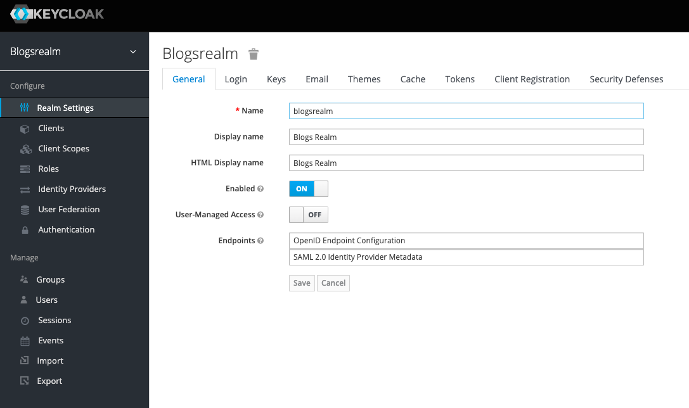
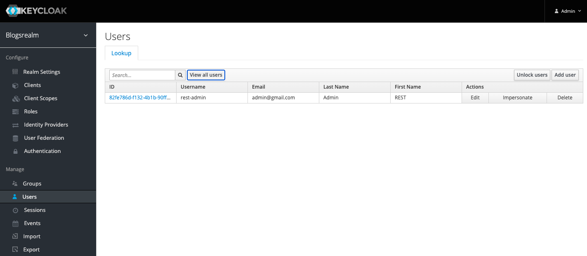
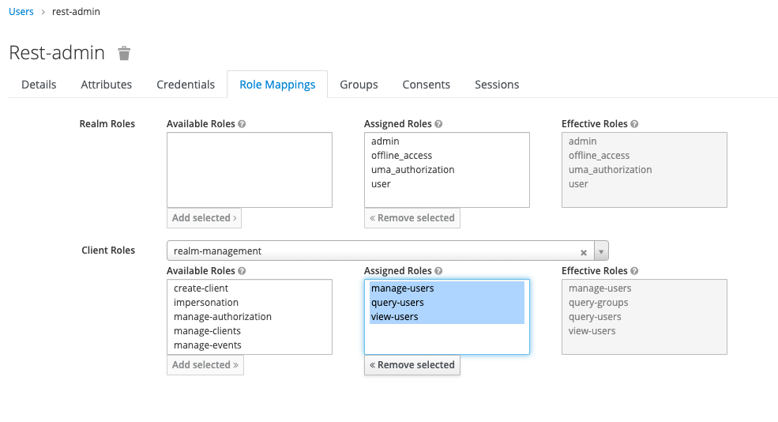

# Login Example

REST API with JWT authentication using an embedded Keycloak authorization server.

## Embedded Keycloak auth server

Keycloak maintains users, roles, clients and performs JWT tokens verification using OpenID Connect (OIDC), an authentication layer on top of OAuth 2.0, acting as an authorization framework.

For more details, please go to:
[blogs-auth-server](blogs-auth-server)

## Secured REST API

The secured REST API is an oauth2-resource-server and publishes the endpoints to be consumed.

For more details, please go to:
[blogs-api](blogs-api)

## Running the app

### 1. Run the authorization server

Start the embedded Keycloak authorization server:

```
cd blogs-auth-server
gradle build
gradle bootRun

```

You should be able to log into the Keycloak administration console:

[http://localhost:8083/auth/](http://localhost:8083/auth/)

Go to Administration Console and then login with username=admin, password=admin.

Realm:



Users:

There is a pre-created user with username **rest-admin** to create, update and view users:





### 2. Run backend app

```
cd blogs-api
gradle build
gradle bootRun

```

The Backend application exposes authentication endpoints and some other endpoints, as an example, with CRUD operations to manage posts and check secured endpoints with a JWT token:

* Login user
* Logout user
* Create user
* Create/Read/Update/Delete Posts

The user accounts are maintained in Keycloak, the Posts are stored by the application in an H2 in-memory database embedded in the Spring Boot application.

After creating a new user you can check it in the Keycloak administration console.

You can check the API Health in:

[http://localhost:8082/actuator/health](http://localhost:8082/actuator/health)


And the Swagger info in:

[http://localhost:8081/blogs/swagger-ui.html](http://localhost:8081/blogs/swagger-ui.html)

There is also available a Postman file with the example requests:

[resources/Login-Example.postman_collection.json](resources/Login-Example.postman_collection.json)

For authenticated endpoints, please make sure you update the Authorization header with the access token returned in the login endpoint response.

### 3. Web Application

A React application has been built to allow login, logout and create user operations.

For more details, please go to:
[https://github.com/advargas/blogs-web](https://github.com/advargas/blogs-web)


